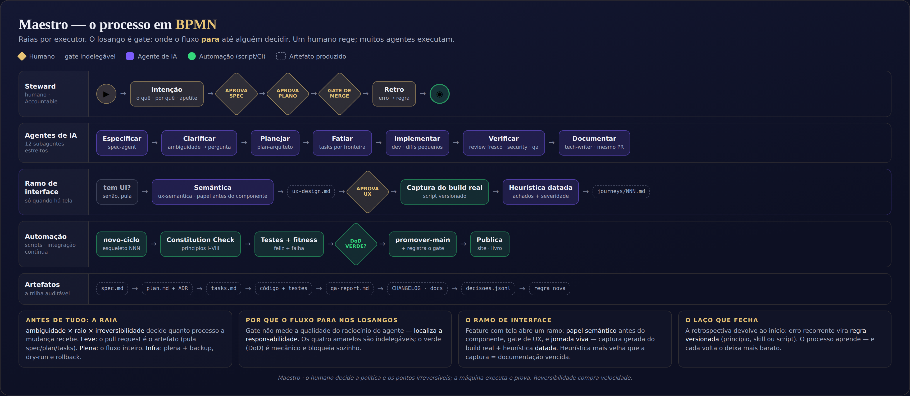

# Maestro — o processo em BPMN

> **BPMN** (*Business Process Model and Notation*, Notação de Modelagem de Processos de
> Negócio) — o método desenhado como processo, com raias por executor.
> Imagem: [`05-bpmn-processo.png`](05-bpmn-processo.png) · fonte:
> [`fontes/05-bpmn-processo.html`](fontes/05-bpmn-processo.html) · gerado no ciclo 017.

## Como ler

**Quatro raias, por quem executa:**

| Raia | Executa |
|---|---|
| **Steward** (humano) | Intenção · os três gates indelegáveis · a retrospectiva |
| **Agentes de IA** | Especificar → clarificar → planejar → fatiar → implementar → verificar → documentar |
| **Automação** | Esqueleto do ciclo · Constitution Check · testes e *fitness functions* · promoção com registro · publicação |
| **Ramo de interface** | Só quando há tela: semântica (papel antes do componente) → `ux-design.md` → ◆gate de UX → captura do build real → heurística datada → journey |
| **Artefatos** | A trilha auditável: `spec.md` → `plan.md`+ADR → `tasks.md` → código+testes → `qa-report.md` → docs → `decisoes.jsonl` → regra nova |

**O losango é onde o fluxo para.** Quatro em ouro (humanos, indelegáveis): aprovar a
spec (DoR), aprovar o plano, o gate de merge e — na raia infra — autorizar deploy ou
migração. Um em verde: a Definição de Pronto (DoD), mecânica, que bloqueia sozinha.

## As três leituras do desenho

1. **Antes de tudo vem a raia de trabalho**: `ambiguidade × raio × irreversibilidade`
   decide quanto processo a mudança recebe. Na raia *leve*, o pull request é o artefato e
   as três primeiras caixas são puladas — o desenho completo é o caso *pleno*.
2. **O gate não julga o raciocínio do agente — localiza a responsabilidade.** Por isso ele
   está na raia do humano, não na dos agentes.
3. **Feature com tela abre um ramo** — o ramo de interface não é opcional quando há UI:
   papel semântico **antes** do componente, gate de UX, e jornada viva (captura gerada do
   build real + heurística **datada**). Heurística mais velha que a captura é documentação
   vencida. *(Acrescentado no ciclo 018: o desenho anterior refletia o toolkit, não a norma.)*
4. **O laço fecha na retrospectiva**: erro recorrente vira regra versionada (princípio,
   skill ou script) e volta ao início. É o que torna o processo mais barato a cada volta.

**Ver também**: [SIPOC](04-sipoc.md) (o mesmo ciclo como cadeia fornecedor→cliente) ·
[Fluxo](03-fluxo.md) (a linha do tempo) · [capítulo 01](../handbook/01-principio-central.md)
(por que os gates estão onde estão).
