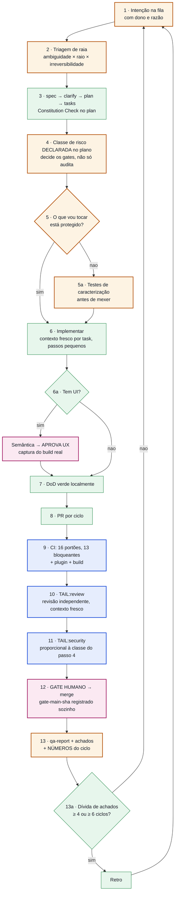

# Maestro — fluxo v5 (proposta, não vigente)

> **Isto é uma proposta, não o processo em vigor.** O processo vigente é a peça
> [05 — BPMN](05-bpmn-processo.md); nada aqui foi adotado. Esta peça existe para dar
> comparação lado a lado com o ciclo de vida desenhado por um arquiteto externo (13 passos)
> e para nomear o que, dessa comparação, o Maestro **não** tem.
>
> Capturado em 2026-08 · ciclo 053 · **seis das dezesseis caixas mudam**: três são novas
> (1, 5, 5a), uma existe hoje de forma implícita e viraria passo explícito (2), uma é
> movida para antes (4) e uma hoje é parcial (13). As outras dez já existem como estão.

## O desenho

**Cores desta peça** — atenção: **não são as das peças 01–05**, porque aqui a pergunta é
*o que muda*, e lá é *quem executa*. 🟠 caixa que **muda** nesta proposta (nova, movida ou
hoje parcial) · 🟢 já existe como está · 🔵 portão automático · 🟣 gate humano.

## Passo a passo, contra o deles

| # | Passo | Situação |
|---|---|---|
| 1 | **Intenção entra na fila**, com dono e razão | **novo** |
| 2 | **Triagem de raia** — ambiguidade × raio × irreversibilidade → leve / plena / infra | **vira passo** |
| 3 | `spec.md` → `/speckit.clarify` → `plan.md` (Constitution Check) → `tasks.md` | temos |
| 4 | **Classe de risco declarada no plano** — decide os gates, não só audita | **movido** |
| 5 | **O que vou tocar está protegido?** | **novo** |
| 5a | senão → **testes de caracterização** primeiro | **novo** |
| 6 | Implementar com contexto fresco por task, passos pequenos | temos |
| 6a | **Se tem UI**: semântica → APROVA UX → captura do build real | temos |
| 7 | DoD verde localmente | temos |
| 8 | PR por ciclo | temos |
| 9 | CI: 13 portões bloqueantes + plugin em dia + build do livro | temos |
| 10 | `TAIL:review` — revisão independente, contexto fresco | temos |
| 11 | `TAIL:security` proporcional à classe do passo 4 | temos |
| 12 | **Gate humano** → merge → `gate-main-<sha>` registrado sozinho | temos |
| 13 | `qa-report.md` + achados + **números do ciclo** | parcial |
| 13a | Retro **disparada por dívida**, não por data | temos |

## As três lacunas reais

**01 · Começamos no meio — mas menos do que parece.** O fluxo deles abre em
`Backlog → selecionar task elegível`. O nosso abre em "Intenção", que vem do Steward.

Fila **existe**, e é preciso dizer isso antes de pedir uma nova: o [roadmap](../roadmap.md)
tem as fases ordenadas **por dependência** (§7) e uma tabela de **gatilhos abertos** — cada
decisão adiada com a condição que a reabre ("1º ciclo regendo código de produto", "dor real
de paralelismo"). O `check-ecosystem.sh` até recusa um veredicto `observar` sem gatilho.

O que **não** existe é o elo entre essa fila e o ciclo: o roadmap não tem **dono por item**
nem critério de elegibilidade, e nada liga "a fase X está pronta para entrar" ao ciclo que
de fato abriu. Foi decisão consciente — cerimônia cortada, ver
[handbook 07](../handbook/07-cerimonias-cadencia.md) — e o custo é que **por que este ciclo
e não aquele** continua sendo julgamento não registrado.

**02 · Sem rede antes de tocar.** O passo 5/5a deles — *cobertura suficiente? senão, testes
de caracterização* — não existe aqui em forma nenhuma: nenhuma skill, nenhum template e
nenhum comando o mencionam
(`grep -riE "caracteriza" skills/ .specify/templates/ .claude/` devolve zero — esta página
é o único lugar do repositório onde a palavra aparece, o que é exatamente o problema).
O nosso TDD manda escrever o teste **da mudança**; nada manda proteger **o que já está lá**.
Para um método que se anuncia como capaz de reger código de produto, é a lacuna que mais dói.

**03 · Aprendizados sim, métricas não.** Temos retro, `docs/records/decisoes.jsonl` e
achados. Métrica, nenhuma: o [modelo operacional](../governance/operating-model.md) lista
*metrics dashboard* como **later / YAGNI** no catálogo de artefatos (§6) e declara a
instrumentação de métricas entre o que deliberadamente não adotamos (§10). É uma escolha, não um esquecimento — mas significa
que o passo 13 fecha com narrativa e sem número.

## A diferença de fundo

O fluxo deles é **descritivo** — descreve o que se espera que aconteça. O nosso, dos passos
9 a 12, é **executável**: os `scripts/check-*.sh` reprovam, e o `scripts/promote-main.sh`
recusa promover enquanto a conformidade estiver vermelha. É a diferença entre um processo
desenhado e um processo que reclama quando não é seguido.

Em compensação, o desenho deles tem um passo que o nosso não tem: **avaliar risco e
segurança antes de implementar**. Aqui a classe de risco governa a aprovação de ação do
agente, e a segurança aparece na cauda (`TAIL:security`). Auditar depois é mais barato que
decidir antes — e pior.

## Duas perguntas antes de isto virar ciclo

1. **A fila (passo 1) é para o Maestro ou para quem instala o método?** Se for para o
   Maestro, é quase um [`roadmap.md`](../roadmap.md) com dono. Se for para os projetos, vira
   artefato instalável — e artefato instalável sem portão apodrece (Princípio VI).
2. **O passo 5/5a vale agora ou é gatilho?** Hoje o Maestro rege o próprio repositório, e
   "código existente desprotegido" ainda não é dor. Pode ser o primeiro item real da raia
   leve no dia em que o método sair para código de produto.

---

Comparado contra [05 — BPMN do processo vigente](05-bpmn-processo.md) · Maestro v0.2.0 ·
16 portões, 13 bloqueantes na integração contínua.
